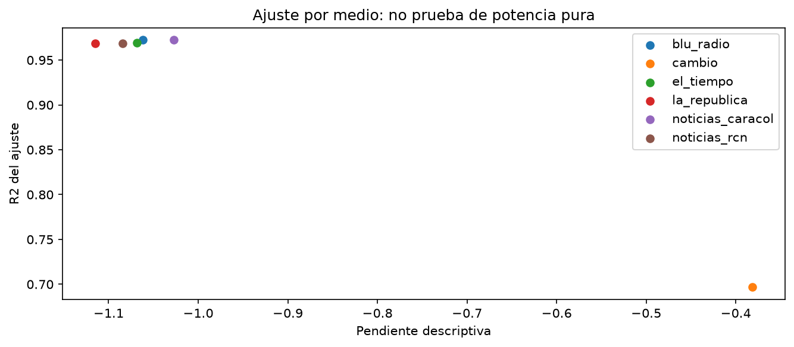
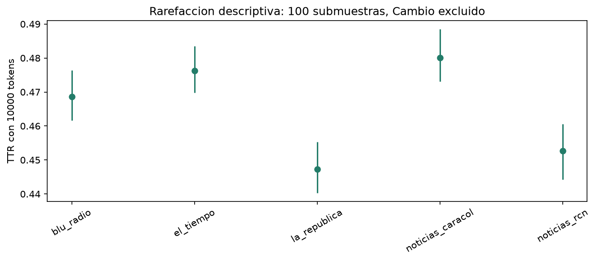
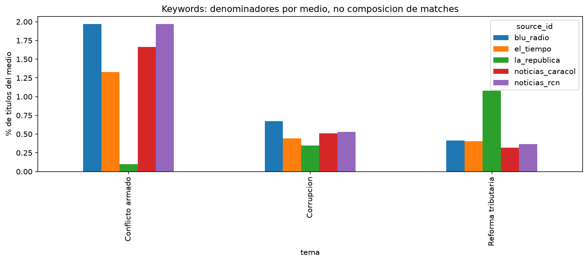
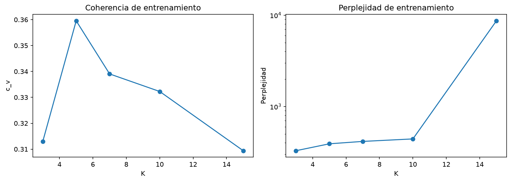
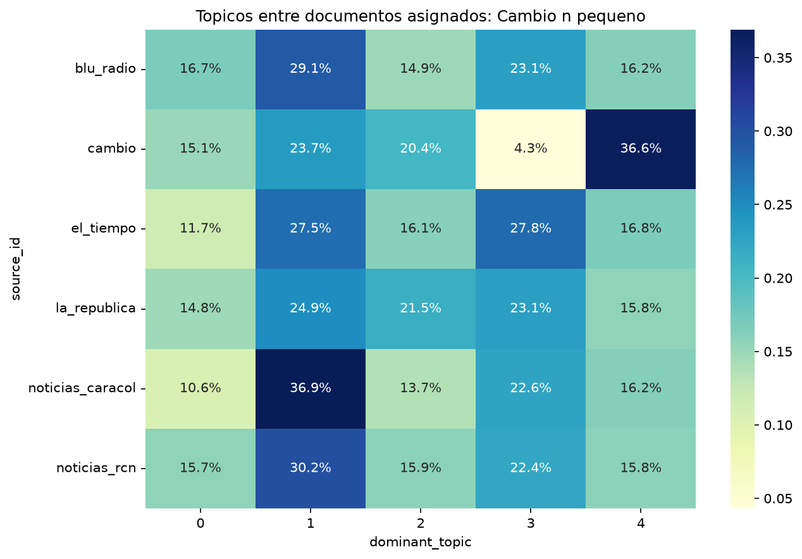
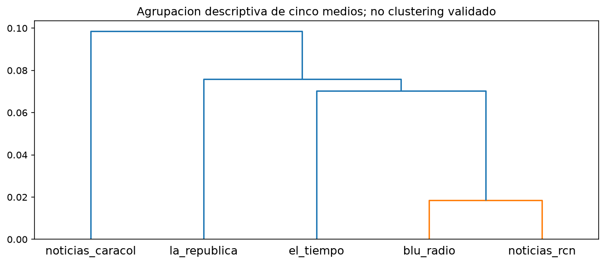

# Deep Research de Entrega 2

Fecha: 2026-10-05. Investigacion local reproducible; sin crawling ni despliegue cloud.

## I. Resumen ejecutivo

Este research audita **708,768 registros** del corte Duque, entre 2018-08-07 y 2022-08-06, frente a su Parquet de entrada, evidencia SQL del origen y resultados publicados localmente. Hay seis medios presentes, pero cinco series principales y solo 98 registros de Cambio. Se completaron **46 verificaciones automaticas** y se generaron contrastes nuevos sin reentrenar LDA, descargar articulos ni modificar PostgreSQL.

**Tres hallazgos comprobados:**

1. La integridad tecnica se sostiene: IDs, fechas, frecuencias, keywords y parametros/asignaciones del modelo coinciden con sus fuentes. Los titulos pasaron de 98 en el original a 707,553 en el export, siempre proxies `slug`. Cambio es una ventana de seis dias del inventario, no una muestra de cuatro anos.
2. Existen asociaciones entre medio y coincidencia tematica bajo el contraste condicional: p-valores Holm pequenos, pero **V de Cramer entre 0,015 y 0,049**. La magnitud es pequena y los supuestos de independencia estan comprometidos por el archivo; no es evidencia causal ni una medicion de sesgo.
3. K=5 gana la grilla por coherencia con margen 0.020499 frente a K=7. Se distinguen **2,685 excluidos sin vocabulario** y **26,282 asignados de confianza <0,3**. La relacion confianza-cobertura de vocabulario es minima (Spearman 0.0030).

**Dos limites centrales:** todo el texto es reconstruccion de URL, sin cuerpos HTML ni anotacion de framing; las fuentes tienen cobertura temporal, volumen, fechas y formatos desiguales. **Conclusion:** se pueden reportar diferencias descriptivas y asociaciones condicionadas, no confirmar ni descartar sesgo editorial, intencion politica o una agenda comun.

Este documento tiene **17 bloques de lectura con saltos sugeridos de pagina**. La extension impresa efectiva depende del renderizador; no se presenta una paginacion de Markdown como medicion fisica de 17 paginas.

## II.1 Metodologia: fuentes y cortes

El origen es `news-corpus-unificado/news_corpus`; el analisis se construyo en `news_duque_work`, aislado del original. Se copiaron ambos agostos completos como candidatos y luego se exporto el corte **inicio inclusivo 2018-08-07, final exclusivo 2022-08-07**. Esta auditoria lee la exportacion final, no consulta una base viva durante los calculos.

| source_id | articles | titles | first_date | last_date |
| --- | --- | --- | --- | --- |
| blu_radio | 166593 | 165916 | 2018-08-07 | 2022-08-06 |
| cambio | 98 | 98 | 2022-08-01 | 2022-08-06 |
| el_tiempo | 263145 | 262968 | 2018-08-07 | 2022-08-06 |
| la_republica | 91801 | 91743 | 2018-08-07 | 2022-08-06 |
| noticias_caracol | 109384 | 109085 | 2018-08-07 | 2022-08-06 |
| noticias_rcn | 77747 | 77743 | 2018-09-01 | 2022-08-06 |

La tabla demuestra el numero de registros y el rango **almacenado**, no la fecha editorial autentica ni la completitud de la cobertura. El export tiene **38,621 fechas month** y **185 asignaciones presidenciales distintas de duque o ausentes dentro del corte de fecha**. No sustituir `government_id` por un filtro de fecha sin explicar esa diferencia.

`title_source` contiene slug y ausente; no hay sitemap/extracted en este export. No hay cuerpo HTML. Son proxies lexicos: se perdieron tildes, puntuacion y posibles cambios de titular. El parquet tiene checksum **`d3fbac63bcd8de1219745dbcb28d7c39429b30dd7f229728214ab8434997e1f3`**. Las tablas originales de Entrega 2 permanecen intactas; el research escribe en otra carpeta.

Provenance de fuentes: `db_evidence.json` es una consulta de solo lectura; `input_coverage.csv`, `audit_checks.csv` y `research_metrics.json` son verificaciones reproducibles. La captura SQL no equivale a comprobar los sitios actuales.

## II.2 Metodologia: procesamiento y contrastes

Se reutiliza la tokenizacion exacta: minusculas, tildes normalizadas, palabras alfabeticas, longitud mayor de dos, stopwords espanolas y verbos de reporte. Se conserva geografia/actores. La igualdad de stopwords se comprobo frente al archivo original. Los n-gramas se forman dentro del titulo despues de retirar stopwords, no sobre frases originales intactas.

TTR = tipos/tokens. MSTTR promedia segmentos **completos de 50 tokens** y descarta el resto. Yule K = `10000*sum(f*(f-1))/N**2`; no se confunde con Simpson. La rarefaccion usa 100 submuestras aleatorias sin reemplazo de 10.000 tokens, semilla 42: sus cuantiles describen variacion del procedimiento, no un intervalo poblacional de diversidad del medio.

Para temas se contrastan **cinco medios x dos estados (keyword si/no)** por cada tema. Cada articulo entra una vez en cada contraste; los temas pueden solaparse entre contrastes. Se usan conteos crudos, Pearson chi-cuadrado sin correccion Yates, diagnostico de esperados, Holm para tres pruebas y V de Cramer. No se usa una tabla 5x3 de temas solapados como si fueran categorias excluyentes, ni porcentajes truncados a enteros.

Para sensibilidad temporal se emplea bootstrap circular de bloques mensuales de longitud 3, 1.000 remuestreos, semilla 42. Las parejas maximo/minimo se eligieron despues de mirar las tasas; los intervalos son exploratorios, no contrastes confirmatorios preespecificados. El contraste LDA principal usa conteos de topico dominante entre documentos asignados de los cinco medios, excluyendo -1.

Supuestos no garantizados: articulos independientes, archivo representativo, mediciones temporales correctas y ausencia de dependencias por programas repetidos. Tests y p-valores no reparan estos problemas de diseno.

## III.1 Textometria: Zipf por medio y outliers

El global se reproduce exactamente: **4,737,325 tokens**, **98,418 tipos**, r=-0.982114, pendiente=-1.034953, R2=0.968981. El ajuste utiliza rangos 10-10.000 con frecuencia mayor de uno; no se extrapola toda la cola.

| source_id | tokens | vocabulario | pearson_r | slope | r2 | hapax |
| --- | --- | --- | --- | --- | --- | --- |
| blu_radio | 1187269 | 51645 | -0.981458 | -1.061893 | 0.972411 | 19648 |
| cambio | 476 | 382 | -0.837267 | -0.381651 | 0.696654 | 337 |
| el_tiempo | 1589451 | 64124 | -0.982835 | -1.068563 | 0.969439 | 26780 |
| la_republica | 623282 | 38854 | -0.982362 | -1.114869 | 0.968554 | 16806 |
| noticias_caracol | 813347 | 43469 | -0.979779 | -1.027281 | 0.972358 | 15564 |
| noticias_rcn | 523500 | 33450 | -0.980253 | -1.084702 | 0.96875 | 13117 |

Los cinco medios principales muestran linealidad log-log parecida; Cambio usa solo 476 tokens y 36 rangos ajustados, con pendiente/R2 diferentes. No afirmar que se comprobo Zipf en todos los medios con el mismo poder.

**r=-1 no es una hipotesis regular de potencia pura** para un Fisher-z ordinario: es una frontera singular. Ademas, rango y frecuencia estan ordenados por construccion. No se realiza una prueba de significancia contra -1 ni se interpreta p de correlacion como certificacion de Zipf. Harian falta ajuste de distribucion, umbral, bondad de ajuste simulada y comparacion con alternativas, atendiendo dependencias de tokens.

Residuos descriptivos extremos del ajuste, no outliers editoriales confirmados:

| palabra | frecuencia | rank | residual_log |
| --- | --- | --- | --- |
| cali | 14186 | 10 | -1.835266 |
| dos | 12854 | 11 | -1.835225 |
| nuevo | 11492 | 13 | -1.774335 |
| millones | 12533 | 12 | -1.770462 |
| gobierno | 10721 | 14 | -1.767084 |
| nueva | 10412 | 15 | -1.724925 |
| programa | 10327 | 16 | -1.666327 |
| duque | 10197 | 17 | -1.616252 |
| completo | 9165 | 19 | -1.60784 |
| columna | 9761 | 18 | -1.600795 |

## III.2 Diversidad: controlar el numero de tokens

Los TTR agregados no se pueden comparar causalmente sobre tamanos tan diferentes. Cambio parece extraordinariamente diverso por tener solo 476 tokens; no se incluyo en las submuestras de 10.000.

| source_id | tokens | ttr_agregado | msttr_50_agregado | ttr_titulo_media |
| --- | --- | --- | --- | --- |
| blu_radio | 1187269 | 0.043499 | 0.959712 | 0.997534 |
| cambio | 476 | 0.802521 | 0.957778 | 0.998542 |
| el_tiempo | 1589451 | 0.040343 | 0.953985 | 0.99625 |
| la_republica | 623282 | 0.062338 | 0.972207 | 0.997762 |
| noticias_caracol | 813347 | 0.053445 | 0.958202 | 0.998735 |
| noticias_rcn | 523500 | 0.063897 | 0.95698 | 0.998818 |

| source_id | budget | repetitions | ttr_mean | q025 | q975 | status |
| --- | --- | --- | --- | --- | --- | --- |
| blu_radio | 10000 | 100 | 0.468566 | 0.4617 | 0.476415 | equal-token rarefaction, not publisher CI |
| cambio | 10000 | 0 | n/d | n/d | n/d | insufficient tokens; excluded |
| el_tiempo | 10000 | 100 | 0.476224 | 0.4698 | 0.48354 | equal-token rarefaction, not publisher CI |
| la_republica | 10000 | 100 | 0.447338 | 0.440248 | 0.45531 | equal-token rarefaction, not publisher CI |
| noticias_caracol | 10000 | 100 | 0.480065 | 0.473137 | 0.488572 | equal-token rarefaction, not publisher CI |
| noticias_rcn | 10000 | 100 | 0.452619 | 0.444298 | 0.460558 | equal-token rarefaction, not publisher CI |

La rarefaccion no conserva secuencia ni agrupacion de documentos: controla presupuesto de tokens, no genero, agenda o independencia. Su orden no coincide necesariamente con MSTTR: son medidas diferentes. No se sostiene la afirmacion de superioridad lexica del 35% de La Republica.

Comparacion mensual pareada de MSTTR, sobre meses comunes de las cinco series:

| highest | lowest | mean | low | high | months |
| --- | --- | --- | --- | --- | --- |
| la_republica | el_tiempo | 0.018148 | 0.015247 | 0.021074 | 48 |

El intervalo de bloques excluye cero en esta pareja exploratoria. El resultado describe regularidad del indicador en el archivo; no demuestra cual medio tiene mejor escritura, ni una diferencia de framing. La seleccion post hoc de la pareja y longitud de bloque fija limitan su lectura inferencial.

## III.3 N-gramas: globales y especificos de medios

Top diez bigramas y trigramas publicados, contrastables con tokens:

| ngram | frecuencia | documentos |
| --- | --- | --- |
| programa completo | 8822 | 8822 |
| blu programa | 3191 | 3191 |
| seleccion colombia | 2901 | 2899 |
| claudia lopez | 2881 | 2879 |
| completo cortes | 2825 | 2825 |
| ivan duque | 2738 | 2737 |
| coronavirus colombia | 2686 | 2686 |
| pico placa | 2664 | 2649 |
| gustavo petro | 2516 | 2516 |
| copa america | 2318 | 2313 |

| ngram | frecuencia | documentos |
| --- | --- | --- |
| blu programa completo | 3191 | 3191 |
| programa completo cortes | 2825 | 2825 |
| populi programa completo | 954 | 954 |
| voz populi programa | 954 | 954 |
| deportivo programa completo | 931 | 931 |
| blog deportivo programa | 919 | 919 |
| nube programa completo | 874 | 874 |
| mananas blu camila | 849 | 849 |
| blu camila zuluaga | 848 | 848 |
| camila zuluaga programa | 839 | 839 |

No atribuir esas secuencias a todos los medios. Al desglosar se observan patrones de programacion/emision y otras diferencias de formato. Una secuencia posterior a stopwords tampoco garantiza adyacencia en el titular editorial.

| source_id | ngram | count | count_per_1000_titles |
| --- | --- | --- | --- |
| blu_radio | programa completo | 8822 | 53.171484 |
| blu_radio | blu programa | 3191 | 19.232624 |
| blu_radio | completo cortes | 2825 | 17.026688 |
| cambio | gustavo petro | 7 | 71.428571 |
| cambio | canal dique | 5 | 51.020408 |
| cambio | nancy pelosi | 3 | 30.612245 |
| el_tiempo | caricatura matador | 1853 | 7.046485 |
| el_tiempo | seleccion colombia | 1742 | 6.62438 |
| el_tiempo | editorial tiempo | 1596 | 6.06918 |
| la_republica | dolar petroleo | 662 | 7.215809 |
| la_republica | america latina | 600 | 6.540009 |
| la_republica | reino unido | 555 | 6.049508 |
| noticias_caracol | video noticias | 1057 | 9.689692 |
| noticias_caracol | pico placa | 724 | 6.637026 |
| noticias_caracol | claudia lopez | 642 | 5.885319 |
| noticias_rcn | pico placa | 914 | 11.756685 |
| noticias_rcn | emision martes | 634 | 8.155075 |
| noticias_rcn | emision miercoles | 623 | 8.013583 |

La tasa por mil titulos facilita escaneo, pero repeticiones de un nombre de programa no equivalen a noticias distintas del mismo hecho. El codigo no filtra automaticamente esos formatos. Una mejora seria requiere catalogar programa/audio/video/noticia escrita y reanalizar una poblacion homogenea; quitar palabras a posteriori solo porque estorban puede ocultar evidencia del sesgo de archivo.

## III.4 Temas: cobertura y denominadores

Se reprodujeron exactamente los 18 conteos medio/tema de Entrega 2. El denominador es el total de titulos disponibles de cada medio, no la suma de matches de tres temas. Los porcentajes no tienen que sumar 100 y los temas pueden solaparse.

| source_id | Conflicto armado | Corrupcion | Reforma tributaria |
| --- | --- | --- | --- |
| blu_radio | 1.969671 | 0.673835 | 0.41527 |
| cambio | 0 | 0 | 0 |
| el_tiempo | 1.328679 | 0.441499 | 0.405753 |
| la_republica | 0.10028 | 0.34662 | 1.078011 |
| noticias_caracol | 1.664757 | 0.511528 | 0.316267 |
| noticias_rcn | 1.971882 | 0.527379 | 0.365306 |

La Republica registra mayor tasa tributaria; RCN/Blu registran mayor tasa del tema amplio de conflicto; Blu registra mayor tasa de keywords de corrupcion. Se habla de **coincidencias**, no de coverage completa ni postura editorial. `violencia`, `fraude` e `impuesto` son palabras amplias con falsos positivos y negativos plausibles.

Sensibilidad al restringir fecha day (se muestra Reforma tributaria; el CSV contiene los tres temas):

| tema | source_id | day_titles | day_matches | pct_day |
| --- | --- | --- | --- | --- |
| Reforma tributaria | blu_radio | 159834 | 678 | 0.42419 |
| Reforma tributaria | cambio | 98 | 0 | 0 |
| Reforma tributaria | el_tiempo | 262968 | 1067 | 0.405753 |
| Reforma tributaria | la_republica | 89076 | 959 | 1.076609 |
| Reforma tributaria | noticias_caracol | 104178 | 336 | 0.322525 |
| Reforma tributaria | noticias_rcn | 53687 | 197 | 0.366942 |

Esta sensibilidad no autentica day: parte procede de lastmod dentro del mes. Es una restriccion tecnica, no una auditoria independiente de publicaciones. No hay anotacion de precision/recall de la recuperacion por keywords.

## III.5 Temas: significancia condicionada y efecto

Contrastes principales sobre los cinco medios con series grandes:

| tema | chi2 | dof | p | p_holm | cramers_v | n | expected_min | asymptotic_cells_ok |
| --- | --- | --- | --- | --- | --- | --- | --- | --- |
| Reforma tributaria | 819.433738 | 4 | 4.740e-176 | 9.480e-176 | 0.034034 | 707455 | 370.772533 | si |
| Conflicto armado | 1702.335914 | 4 | <1e-300 (underflow) | <1e-300 (underflow) | 0.049054 | 707455 | 1121.218776 | si |
| Corrupcion | 162.230762 | 4 | 4.858e-34 | 4.858e-34 | 0.015143 | 707455 | 391.76173 | si |

Todos los esperados superan cinco. Bajo las condiciones del modelo, se rechaza independencia medio/match en los tres temas despues de Holm. Los V pequenos (0,015-0,049) y el gran N explican por que p-valores diminutos no significan efecto sustantivo grande. Un cero computacional de p es underflow; no se presenta como probabilidad exactamente cero.

No afirmar que las asociaciones son "aleatorias" porque sean pequenas, ni que son sesgo editorial porque sean significativas. El contraste no controla el programa, el periodo, la seleccion del sitemap ni el acontecimiento. La dependencia entre noticias tambien hace que la precision estadistica sea demasiado optimista.

Sensibilidad de diferencias porcentuales con meses pareados y bloques de longitud 3:

| source_id | tema | value | n | low | high |
| --- | --- | --- | --- | --- | --- |
| la_republica vs noticias_caracol | Reforma tributaria | 0.724145 | 49 | 0.617519 | 0.823617 |
| noticias_rcn vs la_republica | Conflicto armado | 2.065878 | 48 | 1.721312 | 2.473522 |
| blu_radio vs la_republica | Corrupcion | 0.347632 | 49 | 0.218257 | 0.497753 |

Las medias mensuales dan igual peso a cada mes y por eso no son iguales a diferencias de las tasas globales ponderadas por volumen. Las parejas fueron elegidas post hoc; sus bandas son descriptivas. Cambio se excluye del contraste principal; su comparacion Fisher es exploratoria y sus Wilson se interpretan solo como ejercicio condicional al modelo binomial, no representatividad real.

## III.6 LDA: seleccion de K y coherencia

Se verifico el argmax de coherencia de la tabla y se cargo el modelo K=5. Los cinco entrenamientos originales usaron 10 pasadas, semilla 42, 50 iteraciones internas y todos los documentos con vocabulary util; este research no los reentreno.

| K | coherence_cv | log_perplexity_bound | perplexity_base2 |
| --- | --- | --- | --- |
| 3 | 0.312985 | -8.358303 | 328.170865 |
| 5 | 0.359546 | -8.609586 | 390.61033 |
| 7 | 0.339047 | -8.696535 | 414.875531 |
| 10 | 0.332265 | -8.787191 | 441.782123 |
| 15 | 0.309404 | -13.083101 | 8677.72666 |

La diferencia de c_v entre K=5 y el segundo K=7 es **0.020499**. Hay un ganador numerico de esa grilla, pero no se midio variabilidad por semillas, particiones o bootstrap; no puede decirse que la diferencia este estadisticamente validada. K=3 gana perplejidad de entrenamiento, mientras K=15 tiene un deterioro fuerte en esa metrica.

El c_v no es exactitud ni porcentaje de documentos bien clasificados. La perplejidad base2 se deriva de un bound de entrenamiento, no de una prueba held-out. La interpretacion de K=5 debe ser exploratoria, condicionada por los titulos cortos, el vocabulario elegido y los generos mezclados.

Para estabilizar: varias semillas por K, alineacion de topicos entre semillas, coherencia por tema, evaluacion held-out y revision humana. No se publica una etiqueta academica de topico como ground truth.

## III.7 LDA: terminos e interpretabilidad

Los terminos y sus pesos coinciden con los del modelo guardado, no se inventaron etiquetas economia/educacion/seguridad:

| topic | terms_top10 |
| --- | --- |
| 0 | emision, bogota, martes, jueves, nacional, miercoles, lunes, colombia, julio, elecciones |
| 1 | covid, colombia, dos, bogota, anos, tras, coronavirus, personas, tres, millones |
| 2 | colombia, duque, ucrania, unidos, presidente, rusia, gobierno, viernes, venezuela, james |
| 3 | colombia, asi, video, tras, pico, primera, america, mundial, nuevo, placa |
| 4 | petro, gustavo, luis, caso, diaz, covid, nuevos, fiscalia, tras, paso |

El topico 0 incorpora programacion/fechas; el 1 pandemia y noticias generales; el 2 politica nacional/internacional mezclada; el 3 movilidad/video/deportes; el 4 actores politicos/deportivos y casos. Son lecturas orientativas de top-words, no clasificaciones verificadas por un experto.

Solapamiento entre pares de topicos:

| first | second | jaccard_top10 | probability_overlap | shared_top10 |
| --- | --- | --- | --- | --- |
| 0 | 1 | 0.111111 | 0.064555 | bogota, colombia |
| 0 | 2 | 0.052632 | 0.051242 | colombia |
| 0 | 3 | 0.052632 | 0.042474 | colombia |
| 0 | 4 | 0 | 0.017604 | n/d |
| 1 | 2 | 0.052632 | 0.06593 | colombia |
| 1 | 3 | 0.111111 | 0.087171 | colombia, tras |
| 1 | 4 | 0.111111 | 0.074183 | covid, tras |
| 2 | 3 | 0.052632 | 0.060248 | colombia |
| 2 | 4 | 0 | 0.053251 | n/d |
| 3 | 4 | 0.052632 | 0.071548 | tras |

Jaccard top10 describe palabras compartidas; el overlap de probabilidades suma minima masa por termino y va de cero a uno. No es una prueba de redundancia ni una distancia editorial. Nombres como Colombia aparecen en varios topicos por decision de conservar geografia. Separar topicos exige leer documentos de alta y baja probabilidad, no solo top-words.

Los ejemplos verificables de Entrega 2 y `low_confidence_examples.csv` permiten esa revision. No se revisaron manualmente todos los articulos ni se anotaron etiquetas verdaderas en este research.

## IV.1 Diferencias entre medios y agrupacion

Distribucion de topico dominante **condicionada a documentos asignados**, distinta del denominador que incluye -1 en la tabla original:

| source_id | 0 | 1 | 2 | 3 | 4 |
| --- | --- | --- | --- | --- | --- |
| blu_radio | 16.6714 | 29.142622 | 14.889452 | 23.096445 | 16.200081 |
| cambio | 15.053763 | 23.655914 | 20.430108 | 4.301075 | 36.55914 |
| el_tiempo | 11.729379 | 27.54958 | 16.142168 | 27.811797 | 16.767076 |
| la_republica | 14.805466 | 24.861988 | 21.482742 | 23.085112 | 15.764693 |
| noticias_caracol | 10.574645 | 36.92035 | 13.71141 | 22.633193 | 16.160401 |
| noticias_rcn | 15.720333 | 30.223492 | 15.861865 | 22.356892 | 15.837418 |

No es una distribucion uniforme cercana al 20% para cada medio. Un chi-cuadrado de cinco medios x cinco topicos obtiene chi2=9887.187, df=16, V=0.059171 y p numericamente subdesbordado. Esto describe una asociacion condicionada al modelo aprendido; no mide sesgo ni agenda comun.

El modelo fue entrenado con documentos de esos mismos medios. La dependencia del topico asignado respecto al entrenamiento y el archivo invalida cualquier lectura causal del contraste. Cambio se observa aparte, no se usa para la asociacion principal por su ventana de seis dias.

## IV.2 Distancias, outliers y clusters descriptivos

Se usa distancia Jensen-Shannon base 2 entre distribuciones de topico dominante entre asignados. Distancia cero significa distribuciones iguales en ese resumen; no titulares iguales ni misma postura. Se eligio linkage promedio para describir proximidad, no para validar una segmentacion de medios.

| source_id | blu_radio | cambio | el_tiempo | la_republica | noticias_caracol | noticias_rcn |
| --- | --- | --- | --- | --- | --- | --- |
| blu_radio | 0 | 0.29271 | 0.071233 | 0.077332 | 0.092005 | 0.018462 |
| cambio | 0.29271 | 0 | 0.317584 | 0.286186 | 0.311082 | 0.289348 |
| el_tiempo | 0.071233 | 0.317584 | 0 | 0.078909 | 0.088439 | 0.069244 |
| la_republica | 0.077332 | 0.286186 | 0.078909 | 0 | 0.131807 | 0.071342 |
| noticias_caracol | 0.092005 | 0.311082 | 0.088439 | 0.131807 | 0 | 0.081553 |
| noticias_rcn | 0.018462 | 0.289348 | 0.069244 | 0.071342 | 0.081553 | 0 |

La pareja principal mas cercana es **blu_radio / noticias_rcn**, distancia **0.018462**. Cambio esta mucho mas lejos, pero su distancia refleja una ventana minuscua y tardia, no una singularidad editorial demostrada.

Distancias al centro ponderado por documentos asignados de los cinco medios principales:

| source_id | value | n |
| --- | --- | --- |
| noticias_rcn | 0.032957 | 77747 |
| el_tiempo | 0.036864 | 263145 |
| blu_radio | 0.039294 | 166593 |
| la_republica | 0.067143 | 91801 |
| noticias_caracol | 0.074266 | 109384 |
| cambio | 0.300305 | 98 |

Caracol y La Republica tienen mayor distancia al centro que otros medios principales en este modelo. No se usaron silhouette, estabilidad de clusters, semillas alternativas ni labels externos; no presentar el dendrograma como descubrimiento de bloques ideologicos. Las correlaciones de perfiles de eventos se apoyan en solo tres temas, por lo que son insuficientes para inferir clusters robustos.

## IV.3 Documentos excluidos y confianza

**Sin asignacion:** 2,685, exactamente los documentos cuyo bag-of-words queda vacio con el diccionario LDA. **Asignados pero confidence <0,3:** 26,282, **3.72% de los asignados**. No sumar ambos y llamarlos "sin topico dominante": los segundos si tienen argmax.

| source_id | all_documents | assigned | excluded | assigned_confidence_lt03 | assigned_confidence_mean | vocab_coverage_mean |
| --- | --- | --- | --- | --- | --- | --- |
| blu_radio | 166593 | 165493 | 1100 | 5619 | 0.511575 | 0.890855 |
| cambio | 98 | 93 | 5 | 4 | 0.503887 | 0.862942 |
| el_tiempo | 263145 | 262759 | 386 | 8394 | 0.497033 | 0.883538 |
| la_republica | 91801 | 91115 | 686 | 5092 | 0.456147 | 0.85814 |
| noticias_caracol | 109384 | 108902 | 482 | 4466 | 0.481121 | 0.871763 |
| noticias_rcn | 77747 | 77721 | 26 | 2707 | 0.495725 | 0.903772 |

Confianza media entre asignados: **0.492568**. Spearman confianza/cobertura de palabras conocidas: **0.003032**; confianza/numero de tokens conocidos: **-0.140613**. La primera asociacion es practicamente nula, la segunda es negativa y limitada; no sostienen una explicacion causal de baja confianza por falta de vocabulario.

El umbral 0,3 es una convencion exploratoria para K=5, cuyo uniforme es 0,2. Confianza es maxima masa posterior, no probabilidad de clasificacion correcta ni calibracion frente a etiquetas verdaderas. No se verifico que el dominante de cada documento sea semanticamente correcto.

Se revalidaron los IDs, medios, fechas, conteos y -1 contra el input y el diccionario. Esta es integridad de asignaciones persistidas, no validacion predictiva. Los cuarenta ejemplos menos confiados estan en `low_confidence_examples.csv`, con URL e informacion de tokens para lectura posterior.

## V.1 Limites de cobertura: Cambio, fechas y titulos

En el inventario completo Cambio registra **44,575 articulos**, desde 2022-08-01 hasta 2026-07-31, y cero fechados antes de agosto de 2022. La captura tiene **48 checkpoints**, 2022-08-01 a 2026-07-01. El subconjunto Duque guarda 98, del 2022-08-01 al 2022-08-06.

Esa interseccion entre cobertura del dump y corte explica el n pequeno. No se encontro un filtro que eliminara titulos por esas tres keywords; las keywords solo se aplican despues sobre todos los 98. Tampoco se puede determinar sin sondeo real si el indice no tenia archivo anterior, si la corrida se limito a Petro o si una migracion altero fechas. La configuracion declara archivo desde 2021, lo que es distinto de haberlo recolectado.

Los registros de Cambio usan `sitemap:lastmod` en su provenance. Por tanto **los seis dias son fechas almacenadas**, no seis dias de publicaciones autenticas verificadas. `completed` y `coverage=completa` son estados del proveedor, no un censo certificado de toda la historia del sitio.

| tema | count | total_titles | wilson_low_pct | wilson_high_pct |
| --- | --- | --- | --- | --- |
| Reforma tributaria | 0 | 98 | 0 | 3.771999 |
| Conflicto armado | 0 | 98 | 0 | 3.771999 |
| Corrupcion | 0 | 98 | 0 | 3.771999 |

Con cero matches sobre 98, el limite Wilson superior es aproximadamente 3,77% para cada tema bajo modelo binomial. No equivale a una estimacion representativa porque la ventana no es aleatoria. Los cero no prueban omision. [Los 98 titulos y URLs](cambio_titles.csv) permiten comprobar directamente el conjunto; sus otros actores y temas no fueron convertidos en supuestas posturas politicas.

## V.2 Limites de medicion e inferencia

Hay **32,368 filas que comparten titulo normalizado con al menos otra fila**. Eso no las vuelve automaticamente duplicados de noticias: un programa puede repetir texto de URL o varios hechos pueden compartir titular. Si se usan como observaciones independientes, se sobredimensiona precision.

Los proxies slug pierden puntuacion, tildes y versiones editoriales; nombres de programas o fechas dominan vocabulario. No hay cuerpo para citas, actores en contexto, seleccion de fuentes o omisiones. Un titulo con keyword puede ser falso positivo; sin keyword puede tratar exactamente el mismo tema. El diccionario LDA elimina terminos raros, algunos actores y documentos completos.

La fecha de precision month no basta para distinguir acontecimientos del mismo dia, y day puede seguir siendo lastmod. Los tests de software no validan procedencia editorial. La inferencia causal requiere un diseno de comparacion de hechos verificados y control de archivo, formatos y tiempo.

No se midio intencion editorial, postura politica ni framing anotado. No se puede afirmar "no hay sesgo" por falta de evidencia, ni "hay sesgo" por p pequeno. No se confirmo Zipf como ley de potencia, ni estabilidad LDA por semillas, ni representatividad de Cambio. Intervalos Wilson y de bootstrap son condicionales al mecanismo elegido, no reparan cobertura faltante.

El research tampoco hizo validacion externa de sitios, evaluacion held-out ni despliegue Replit. Esta separacion entre prueba tecnica e interpretacion sustantiva debe mantenerse en presentaciones y UI.

## VI. Conclusiones y recomendaciones

**Se puede afirmar:** integridad tecnica del corpus y de los resultados auditados; titulos mayoritariamente slug; Cambio es una subventana tardia; diferencias de tasas de keywords con efectos pequenos bajo el contraste condicional; medidas de diversidad sensibles al presupuesto de tokens; K=5 gana coherencia de esa grilla; perfiles tematicos no uniformes; exclusiones y confianza baja son fenomenos distintos.

**No se puede afirmar:** sesgo editorial confirmado o ausente; agenda comun; clasificacion correcta de todos los documentos; superioridad de diversidad del 35%; ausencia de noticias en Cambio; bloques ideologicos a partir de dendrogramas o intencion politica a partir de una palabra.

**Prioridades siguientes:**

1. Seleccionar pares de acontecimientos con documentos reales y anotacion humana, no solo keywords.
2. Recuperar titulares publicados/cuerpos en una submuestra balanceada por medio, mes y formato, respetando disponibilidad y robots.
3. Auditar fechas de posesion y lastmod; tratar por separado day/month/gobierno incierto.
4. Repetir LDA con varias semillas, revisar estabilidad y medir coherencia/evaluacion fuera de entrenamiento.
5. Analizar series temporales con controles de formato; comparar Duque/Petro solo en ventanas comunes y corpus igualmente procesados.
6. En Replit mostrar valores, denominadores, intervalos y limites, con Cambio apartado y controles de scope; nunca titular un grafico como "sesgo detectado".

Los entregables se mantienen locales. No se ejecuto commit ni push. La guia adjunta distingue un dashboard liviano de tablas verificadas de la reproduccion completa, que necesita datos/modelos disponibles y un entorno Python compatible.

## Anexo. Evidencia, validacion y trazabilidad

**Checksum de entrada:** `d3fbac63bcd8de1219745dbcb28d7c39429b30dd7f229728214ab8434997e1f3`.

**Evidencia SQL:** [db_evidence.json](db_evidence.json), solo lectura. **Auditoria:** [audit_checks.csv](audit_checks.csv), 46 checks aprobados. **Metricas completas:** [DATA_INSIGHTS_TABLES.csv](DATA_INSIGHTS_TABLES.csv), 90 registros en formato largo, y [research_metrics.json](research_metrics.json).

La auditoria detecto una falsa discrepancia del lector CSV: el token literal `nan`, con una aparicion, se interpretaba como nulo. Se preservaron palabras con `keep_default_na=False` y el reconteo exacto paso. Tambien se adapto factorize a pandas 3 usando un array, sin cambiar el muestreo.

Los helpers tienen 14 tests de software aprobados. El notebook/PDF/PPT originales ya estaban generados: este research no los presenta como validacion editorial independiente. El PPT no fue renderizado en PowerPoint y Replit no se desplego. El paquete de research no reentrena ni modifica resultados originales.

Fuentes metodologicas de referencia: Entman (1993), framing; Blei, Ng y Jordan (2003), LDA; Clauset, Shalizi y Newman (2009), evaluacion de distribuciones de potencia; Holm (1979), ajuste secuencial; Wilson (1927), intervalos de proporcion. Se emplean como orientacion metodologica, no como validacion externa de este corpus.

Los hallazgos se recomputan mediante `research.py`; los documentos se regeneran con `research_report.py`. Para cambiar reglas, diccionario, datos o ventanas, usar otra carpeta y no mezclar tablas viejas con nuevas. Las hipotesis futuras deben especificarse antes de elegir parejas o thresholds.
